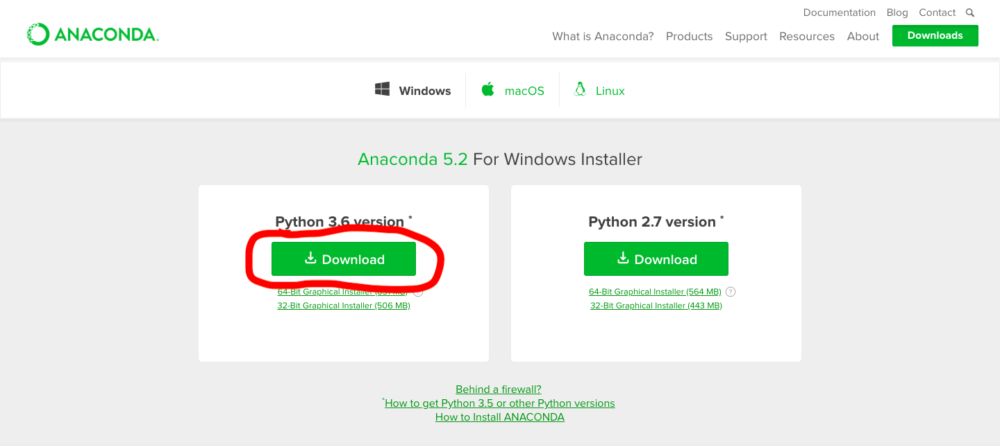
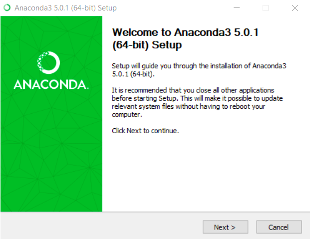
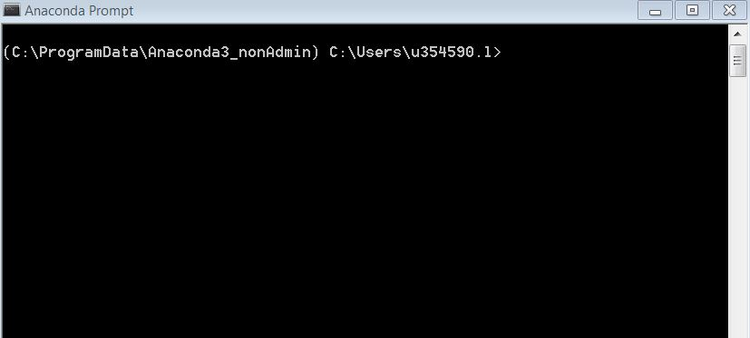

# Co nainstalovat pro ML

Nejsnadnější způsob jak připravit počítač na *machine learning* v *pythonu* je pomocí [Anacondy](https://www.anaconda.com/). Jedná se o software shromažďující vědecké balíčky pro *python* s vhodným vývojovým prostředím.

## 1. Instalace Anacondy

1. Stáhneme Anaconda s python 3.6 z [tohoto odkazu](https://www.anaconda.com/download/), kde je možné vybrat preferovaný operační systém (OS). 
2. Provedeme instalaci Anacondy, při které nám v počítači přibude správná verze samotného *pythonu* a několik základních vědeckých balíčků. Tato část se bude částečně lišit v závislosti na OS, na Windows by měla vypadat následovně. 
3. Následně musíme aktualizovat všechny balíčky, což provedeme pomocí Anacodního *package manageru* **conda**. Otevřeme *Anaconda Prompt* (způsob se bude lišit dle OS) a zadáme postupně:
    ```bash
    conda update conda
    conda update --all
    ```

## 2. Instalace Tensorflow a Keras

[Tensorflow](https://www.tensorflow.org/) je průlomový software (psaný v C++ s API do pythonu) pro práci s *machine learning* algoritmy, primárně *neuronovými sítěmi* (NN). Je však poměrně nízkoúrovňový (budete muset násobit matice), proto vznikl balíček [Keras](https://keras.io/) (budete pouze specifikovat vrstvy), který značně usnadňuje tvorbu NN. Který ze dvou balíčků je lepší použít záleží vždy na situaci a komplexnosti problému.

1. Otevřte si *Anaconda Prompt* (způsob se bude lišit dle OS a výsledek by měl vypadat jako na obrázku níže). 
2. Pro instalaci Tensorflow zadejte: `pip install --ignore-installed --upgrade tensorflow`.
3. Pro instalaci Keras zadejte: `pip install keras`.

Tento způsob by měl fungovat uživatelům Windows. Instalace Tensorflow je poměrně *tricky*, uživatelé ostatních OS se mohou podívat do [návodu na webu Tensorflow](https://www.tensorflow.org/install/), řešení pro Anacondu by se mělo nacházet v kapitole "*Use pip in Anaconda*".

### Test

1. Otevřete *Anaconda Prompt*,
2. zadejte `python`, měl by se lehce změnit obsah okna,
3. zadejte `import tensorflow`,
4. zadejte `import keras`.

Pokud se v okně nic neudálo, jen se nabídl další řádek pro další příkaz, vše je, jak má být (viz obrázek níže, který snad nezapomenu dodat). Pokud ne, někde v instalaci nastal problém.

## 3. Instalace Jupyter Lab
[JupyterLab](https://jupyterlab.readthedocs.io/en/stable/) je nové prostředí vhodné pro vědecké výpočty a machine learning, kde se nemusíme zaobírat pythonem, jako programovacím jazykem, ale snadněji, jako chytrou kalkulačkou.

1. Otevřete *Anaconda Prompt*,
2. zadejte: `conda install -c conda-forge jupyterlab `.

### Test

1. Otevřete *Anaconda Prompt*,
2. zadejte: `jupyter lab`.

V *Anaconda Prompt* by se mělo ukázat něco obdobného jako na obrázku níže (který snad dodám), případně by se mělo otevřít okno prohlížeče.

## Odkazy

V případě problému, zájmu, nebo protestujícího OS doporučuji proklikat následující odkazy:

- [Conda package manager](https://conda.io/docs/),
- [Tensorflow](https://www.tensorflow.org/install/),
- [Keras](https://keras.io/#installation),
- [Jupyter lab](https://jupyterlab.readthedocs.io/en/stable/),
- [Google](https://www.google.com/) (odpoví na víc věcí než  já).
