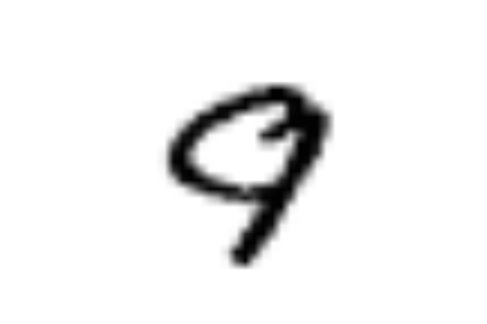
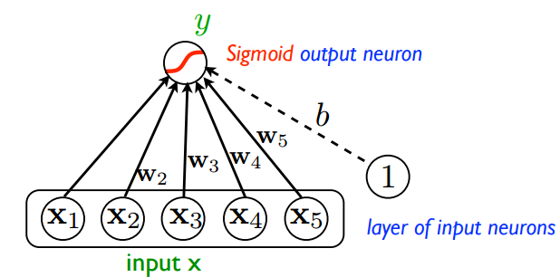

# TensorFlow
V této části si ukážeme základy práce s balíčkem TensorFlow na tradičním příkladu rozpoznávání ručně psaných číslic ze známého MNIST datasetu.

## Data
Jako zdroj dat nám poslouží [Kaggle](https://www.kaggle.com),  konkrétně jedna z jeho známých [výukových soutěží](https://www.kaggle.com/c/digit-recognizer) na strojové vidění. Data stáhnete také [zde](https://www.kaggle.com/c/digit-recognizer/download/train.csv), mají přibližnš 78 MB. Jedná se o 28x28px obrázky uložené ve formátu .csv. Má dohromady 785 sloupců, kde první číslo v řádku je hledaná číslice a následující čísla jsou příslušné pixely definující obrázek. Každý pixel je představen jedním číslem mezi 0 a 255, jedná se tedy o dvoubarevné obrázky. Další informace o datech lze dohledat na  [stránce jim věnovené](https://www.kaggle.com/c/digit-recognizer/data) nebo ve složce s daty.

## Cíl
Jak jsem již naznačil, našim úkolem bude naučit počítač, aby sám zjistil, že na následujícím obrázku je číslice **9**.

  
 <!--   -->

## Modely
### 01. Logistická regrese
V prvním modelu implementujeme [logistickou regresi](https://en.wikipedia.org/wiki/Logistic_regression) na 1D vektory reprezentující obrázky čísel. Každý vstupní vektor přenásobíme maticí, přičteme bias a aktivujeme pomocí [softmax funkce](https://en.wikipedia.org/wiki/Softmax_function) (vícerozměrná varianta funkce sigmoid). Jedná se tedy v podstatě o neuronovou síť bez jediné skryté vrstvy.

Optimalizaci provedeme pomocí metody [Gradient Descent](https://en.wikipedia.org/wiki/Gradient_descent), kvůli přehlednosti budeme pro validaci používat pouze tréninkovou sadu.

### 02. Neuronová síť
Dále implementujeme plně propojenou neuronovou síť s právě jednou skrytou vrstvou. Pro trénink použijeme opět [Gradient Descent](https://en.wikipedia.org/wiki/Gradient_descent). 

  

Po validaci na testovací sadě se však ukáže, že jsme problém [**overfitovali**](https://en.wikipedia.org/wiki/Overfitting). To znamená, že místo toho, aby se síť naučila obecné struktury, které oddělují obrázky jednotlivých čísel, si zapamatovala každý obrázek v tréninkové sadě. Tím pádem, když jsme jí ukázali validační a testovací sady (které při tréninku neviděla), byla v koncích.

 Zároveň také trvá urputně dlouho (to je celkem relativní). Nezoufejme, umíme to i lépe.

### 03. NN + SGD + Dropout
V předchozím případě se naše neuronová síť ukázala jako [**overfitovaná**](https://en.wikipedia.org/wiki/Overfitting) a pomalá.

První problém vyřešíme zavedením [**dropout**](https://en.wikipedia.org/wiki/Dropout_(neural_networks)) vrstvy. Ta při každém průchodu sítí v určitém místě náhodně vybere specifikované množství neuronů a zahodí je. I přesto, jak triviální je to nápad, nám to významně pomůže proti overfitingu (lépe než [L2 regularizace](https://en.wikipedia.org/wiki/Regularization_(mathematics))). Při užití [**dropout**](https://en.wikipedia.org/wiki/Dropout_(neural_networks)) regularizace síť ztrácí schopnost zapamatovat si jednotlivé obrázky, protože ten stejný obrázek uvidí vždy trochu jinak. Více info v původním [článku](https://www.cs.toronto.edu/~hinton/absps/JMLRdropout.pdf).

Problém pomalého tréninku vyřešíme tzv. [**Stochastic Gradient Descent (SGD)**](https://en.wikipedia.org/wiki/Stochastic_gradient_descent). Jedná se o optimalizační techniku podobnou [GD](https://en.wikipedia.org/wiki/Gradient_descent) s jediným rozdílem. Místo toho, abyste pro potřeby [GD](https://en.wikipedia.org/wiki/Gradient_descent) počítali ztrátovou funkci z celého datasetu, vypočítáte ztrátovou funkci pouze z její části.

 

### 04. Implementace v Keras
Keras je knihovna shromažďující několik ML balíčků (např. [Theano](http://deeplearning.net/software/theano/), [TensorFlow](https://www.tensorflow.org/), ...), která slouží jako intuitivní API pro snadný vývoj ML modelů. To, co jsme v [TF](https://www.tensorflow.org/) napsali na 150 řádků, napíšeme v Keras na necelých 60.

V Keras implementujeme stejný model jako v předchozí kapitole s jediným rozdílem. Místo [SGD](https://en.wikipedia.org/wiki/Stochastic_gradient_descent) použijeme [Adam](https://arxiv.org/pdf/1412.6980.pdf) optimalizační algoritmus. Jedná se o zdokonalenou verzi [SGD](https://en.wikipedia.org/wiki/Stochastic_gradient_descent), která je momentálně nejčastěji užívána při tréninku NN.

Může být matoucí, že knihovnu keras, která slouží jako snadnější vstup do knihovny TF, importujeme právě z útrob TF. V poslední aktualizaci TF se stalo právě to, že pro snadnější užívání Kerasu a TF v jednom kódu se programátoři Googlu rozhodli Keras připojit přímo do kódu TF. My alespoň nemusíme instalovat další balíček.

## Úspěšnost
|                      | Train Accuracy | Validation Accuracy | Test Accuracy |
|----------------------|:--------------:|:-------------------:|:-------------:|
| Logistická regrese   |         82.0 % |          -          |       -       |
| Neurovoná síť        |         82.0 % |              80.9 % |        80.9 % |
| NN + SGD + Dropout   |         80.5 % |              89.8 % |        90.5 % |
| Implementace v Keras |         96.8 % |              97.0 % |        96.2%  |

